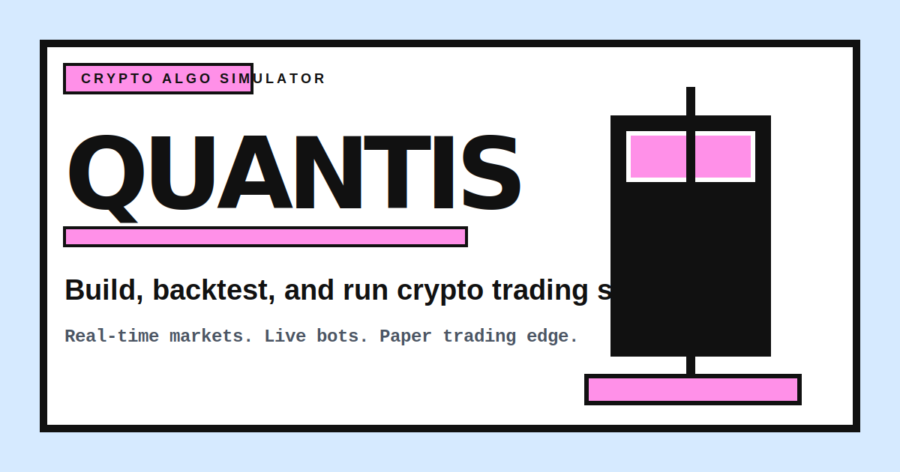

# QUANTIS

**Build, backtest & run crypto trading strategies — now with AI coaching**

 [](https://app.quantis.workers.dev) [](#license) [](#tech-stack)

## Screenshot / Demo

> 🎬 **[Watch the demo video](YOUR_VIDEO_URL)**



## Overview

Quantis is a full-stack crypto algorithmic trading simulator for building, testing, and operating Python strategies from the browser. It gives users a Monaco-powered strategy editor, Supabase-backed accounts and portfolios, a Python simulation worker, real Binance market data, and a Cloudflare cron engine that can keep active strategies running automatically.

The project solves a common problem for early algorithmic traders: ideas are easy to describe, but hard to validate safely. Quantis turns that workflow into a tight loop: write strategy logic, scan supported USDT markets, inspect logs and chart markers, persist simulated trades, and compare results on a leaderboard without touching real capital.

Quantis now includes two AI workflows powered by Groq Llama 3.3 70B. The AI Strategy Coach supports chat, strategy analysis, and portfolio recommendations over streaming SSE. The AI Strategy Generator converts a plain-English trading idea into runnable Quantis-compatible Python code, validates it for the required `on_candle(candle, portfolio)` interface, blocks unsafe generated code, and opens it in the editor as a draft for human review.

## Features Table

| Feature | Description | Status |
| --- | --- | --- |
| Authentication | Supabase Auth with JWT sessions, email/password, magic links, and OAuth callback support. | Implemented |
| Strategy Editor | Monaco Python editor with strategy naming, save, run, go-live controls, chart markers, and terminal logs. | Implemented |
| Market Scanner | Scans supported Binance USDT markets and ranks the strongest backtest result using real candle data. | Implemented |
| Backtesting | Python simulation worker executes `on_candle(candle, portfolio)` against Binance klines and returns trades, equity, logs, and metrics. | Implemented |
| AI Coach | Groq-powered coach with chat, analyze, and recommend modes over streaming SSE. | Implemented |
| AI Generator | Natural language trading idea to Quantis-compatible Python strategy, with safety checks and one-click editor handoff. | Implemented |
| Leaderboard | ROI rankings, percentile banner, timeframe views, and public performance discovery. | Implemented |
| Cloudflare Edge Deployment | Next.js deployed through OpenNext on Cloudflare Workers, plus scheduled cron and simulation workers. | Implemented |

## Tech Stack

### Frontend

- **Next.js 16 App Router**: authenticated app routes, public marketing routes, API route handlers, metadata, sitemap, and robots.
- **React 19 + TypeScript**: strict typed components, stateful editor surfaces, and client-side AI interactions.
- **Tailwind CSS 4**: neo-brutalist design tokens, heavy borders, hard shadows, and responsive layouts.
- **Monaco Editor**: browser-based Python strategy editing with VS Code-style ergonomics.
- **Lightweight Charts**: live candlestick charts and strategy trade markers.

### Backend

- **Next.js Route Handlers**: authenticated AI APIs, Supabase callback handling, validation, and streaming responses.
- **Cloudflare Workers**: edge runtime for the app, scheduled bot engine, and Python simulation worker.
- **Python simulation engine**: executes user strategy code against candle data through the Quantis portfolio API.
- **Zod**: request validation for AI endpoints and typed request contracts.

### AI

- **Groq Llama 3.3 70B Versatile**: low-latency AI coach and strategy generation.
- **Streaming SSE**: token-by-token AI Coach responses in the browser.
- **Prompt-constrained code generation**: generator prompt injects the real worker interface and available runtime constraints.
- **Generated-code safety gate**: blocks unsafe imports and file/process execution primitives before returning code.

### Database

- **Supabase Postgres**: users, algorithms, trade history, and portfolio state.
- **Supabase Auth**: JWT sessions, OAuth callback flow, protected routes, and server-side user lookup.
- **Row Level Security**: user-scoped strategy and portfolio data access.

### Infrastructure

- **OpenNext for Cloudflare**: builds the Next.js app for Cloudflare Workers.
- **Wrangler**: local preview, secrets, and Cloudflare deployment.
- **GitHub Actions**: CI on every push and deployment on `main`.
- **Docker**: Node.js container path for local judging and reproducible app startup.

## AI Features

### AI Strategy Coach

The AI Strategy Coach is a Groq-powered assistant built for algorithmic crypto trading. It has three modes:

- **Chat**: conversational Q&A about risk, entries, exits, position sizing, and implementation details.
- **Analyze**: paste strategy code and receive structured feedback covering logic, risk management, weaknesses, improvements, and verdict.
- **Recommend**: send portfolio or backtest metrics and receive prioritized optimization actions.

The route at `POST /api/ai/coach` streams Groq-compatible SSE chunks directly to the client. Request history is capped before forwarding to Groq, inputs are validated with Zod, and responses include no-store/security headers.

```json
{
  "mode": "chat",
  "message": "How can I reduce drawdown in a breakout strategy?",
  "history": [
    { "role": "user", "content": "My bot buys strong green candles." },
    { "role": "assistant", "content": "Add volatility and trend filters first." }
  ]
}
```

```json
{
  "mode": "analyze",
  "strategy": "def on_candle(candle, portfolio):\n    close = float(candle[4])\n    if close > 65000:\n        portfolio['buy'](amount=0.5)",
  "message": "Focus on false signals and exits."
}
```

```json
{
  "mode": "recommend",
  "portfolioData": {
    "strategyName": "Momentum Scalper",
    "totalReturn": "+8.2%",
    "maxDrawdown": "-5.4%",
    "winRate": "52%",
    "totalTrades": 31
  },
  "message": "What should I improve first?"
}
```

### AI Strategy Generator

The AI Strategy Generator turns a plain-English trading idea into a complete Python strategy that matches the Quantis worker interface. The API injects the real simulation contract into the system prompt:

```python
def on_candle(candle, portfolio):
    # candle = [timestamp, open, high, low, close, volume]
    # portfolio["cash"], portfolio["position"]
    # portfolio["buy"](amount=0.0 to 1.0)
    # portfolio["sell"](amount=0.0 to 1.0)
```

Generated code is never auto-saved or auto-activated. The user must open it in the editor, review it, run a test, and explicitly save or go live.

Example request:

```json
{
  "description": "Buy pullbacks during an uptrend when volume expands. Sell on bearish reversal or after 4 percent profit.",
  "riskLevel": "medium",
  "preferredIndicators": ["EMA", "Volume", "ATR"]
}
```

Example response:

```json
{
  "strategyName": "Buy Pullbacks During An Uptrend",
  "code": "\"\"\"EMA pullback strategy for Quantis...\"\"\"\n\ncloses = []\n\ndef on_candle(candle, portfolio):\n    close = float(candle[4])\n    ..."
}
```

Safety checks reject generated code that does not implement `on_candle(candle, portfolio)` or contains dangerous operations such as `import os`, `import subprocess`, `import sys`, `__import__`, `open(`, `write(`, or `exec(`.

## Architecture Diagram

```text
Browser
  |
  v
[Next.js App Router on Cloudflare]
  |                      |
  |                      +--> [Groq API]
  |                      |
  |                      +--> [Supabase Postgres]
  |
  +--> [Python Sim Worker] --> [Binance Market Data]

[Cloudflare Cron Worker]
  |
  v
[Python Sim Worker]
  |
  v
[Supabase]
```

The browser talks to the Cloudflare-hosted Next.js app for authenticated pages and API routes. The app uses Supabase for auth/data and Groq for AI workflows. Manual backtests and scheduled cron runs execute strategies through the Python simulation worker, then persist trades and portfolio updates back to Supabase.

## Getting Started

### Prerequisites

- Node.js 20+
- npm
- Python 3.11+ for the simulation worker container
- Supabase project
- Groq API key
- Cloudflare account and Wrangler for deployment
- Docker Desktop if using the containerized path

### Clone

```bash
git clone https://github.com/NA0XY/Quantis.git
cd Quantis
```

### Install

```bash
npm install
```

### Environment Setup

Create a local environment file:

```bash
cp .env.local.example .env.local
```

Minimum local variables:

| Variable | Purpose |
| --- | --- |
| `NEXT_PUBLIC_SUPABASE_URL` | Browser/server Supabase project URL |
| `NEXT_PUBLIC_SUPABASE_ANON_KEY` | Supabase anon key for browser auth |
| `SUPABASE_SERVICE_ROLE_KEY` | Trusted backend and worker operations |
| `GROQ_API_KEY` | AI Coach and AI Generator requests |
| `NEXT_PUBLIC_WORKER_URL` | Python simulation worker URL |

### Run Dev

```bash
npm run dev
```

Open [http://localhost:3000](http://localhost:3000).

If you want local backtests, run or deploy the simulation worker and set `NEXT_PUBLIC_WORKER_URL` accordingly.

### Run Tests

```bash
npm test
npm run lint
npm run typecheck
```

### Docker

```bash
docker compose up --build
```

The app will be available at [http://localhost:3000](http://localhost:3000).

## Environment Variables

| Variable | Required | Description | Where to get it |
| --- | --- | --- | --- |
| `NEXT_PUBLIC_SUPABASE_URL` | Yes | Supabase project URL exposed to the browser. | Supabase project settings |
| `NEXT_PUBLIC_SUPABASE_ANON_KEY` | Yes | Public anon key for Supabase Auth and RLS-protected browser queries. | Supabase project API settings |
| `SUPABASE_URL` | Recommended | Supabase project URL for worker-style services that do not use `NEXT_PUBLIC_`. | Supabase project settings |
| `SUPABASE_SERVICE_ROLE_KEY` | Yes for cron/worker writes | Server-only key for trusted writes such as trade persistence and portfolio updates. Never expose in browser code. | Supabase project API settings |
| `GROQ_API_KEY` | Yes for AI | Groq API key used by AI Coach and AI Strategy Generator. | [Groq Console](https://console.groq.com) |
| `NEXT_PUBLIC_WORKER_URL` | Yes for backtests | URL of the Python simulation worker used by the editor scanner. | Cloudflare Workers dashboard or local Wrangler URL |
| `NEXT_PUBLIC_SITE_URL` | Recommended | Canonical app URL used for auth redirects and metadata. | Your deployed app domain |
| `SIM_WORKER_URL` | Yes for cron | Simulation worker URL used by the scheduled bot worker. | Cloudflare Workers dashboard |
| `CRON_RUN_SECRET` | Yes for manual cron trigger | Bearer token protecting manual cron execution endpoint. | Generate locally with a password manager or `openssl rand` |
| `CLOUDFLARE_API_TOKEN` | CI deploy only | GitHub Actions token for Wrangler deploys. | Cloudflare API Tokens |
| `CLOUDFLARE_ACCOUNT_ID` | CI deploy only | Cloudflare account ID for deployment. | Cloudflare dashboard |
| `GOOGLE_CLIENT_ID` | Optional | Google OAuth client ID if configuring Google provider outside the Supabase dashboard. | Google Cloud Console |
| `GOOGLE_CLIENT_SECRET` | Optional | Google OAuth client secret if configuring Google provider outside the Supabase dashboard. | Google Cloud Console |

For the current Supabase Auth setup, Google OAuth is normally configured in the Supabase dashboard under Authentication Providers. The app itself relies on Supabase Auth callbacks rather than reading Google secrets directly.

## Deployment

Quantis deploys the Next.js app to Cloudflare Workers through OpenNext.

### Configure Cloudflare Secrets

Run these from the project root after logging in with Wrangler:

```bash
npx wrangler secret put NEXT_PUBLIC_SUPABASE_URL
npx wrangler secret put NEXT_PUBLIC_SUPABASE_ANON_KEY
npx wrangler secret put SUPABASE_URL
npx wrangler secret put SUPABASE_SERVICE_ROLE_KEY
npx wrangler secret put GROQ_API_KEY
npx wrangler secret put NEXT_PUBLIC_SITE_URL
npx wrangler secret put NEXT_PUBLIC_WORKER_URL
```

Configure cron worker secrets:

```bash
npx wrangler secret put SUPABASE_SERVICE_ROLE_KEY --config wrangler.cron.jsonc
npx wrangler secret put CRON_RUN_SECRET --config wrangler.cron.jsonc
npx wrangler secret put SIM_WORKER_URL --config wrangler.cron.jsonc
```

### Deploy the Web App

```bash
npm run deploy
```

This runs the OpenNext Cloudflare build and deploys through Wrangler.

### Deploy the Cron Worker

```bash
npm run deploy:cron
```

The cron worker runs active algorithms on a five-minute schedule and persists new simulated trades to Supabase.

### GitHub Actions Deployment

Add these repository secrets before relying on automatic deployment:

```text
NEXT_PUBLIC_SUPABASE_URL
NEXT_PUBLIC_SUPABASE_ANON_KEY
CLOUDFLARE_API_TOKEN
CLOUDFLARE_ACCOUNT_ID
```

Runtime secrets such as `GROQ_API_KEY` and `SUPABASE_SERVICE_ROLE_KEY` should also be configured on Cloudflare with `wrangler secret put`.

## Docker

Run the full stack locally with Docker Compose:

```bash
cp .env.local.example .env.local
# fill in your Supabase and Groq credentials in .env.local

docker compose up --build
```

The app will be available at [http://localhost:3000](http://localhost:3000).

To run only the Next.js frontend:

```bash
docker build -t quantis .
docker run -p 3000:3000 --env-file .env.local quantis
```

## CI/CD

Quantis uses GitHub Actions for automated quality gates and Cloudflare deployment.

- **CI** runs on every push to any branch and on pull requests to `main`.
- **CI pipeline** installs dependencies, runs ESLint, runs TypeScript checks, executes Vitest, performs Python worker linting, and builds the Next.js app.
- **Deploy pipeline** runs on pushes to `main`, repeats the quality gates, builds the OpenNext Cloudflare bundle, and deploys with Wrangler.
- **Required GitHub secrets**: `NEXT_PUBLIC_SUPABASE_URL`, `NEXT_PUBLIC_SUPABASE_ANON_KEY`, `CLOUDFLARE_API_TOKEN`, and `CLOUDFLARE_ACCOUNT_ID`.

Workflow files:

- `.github/workflows/ci.yml`
- `.github/workflows/deploy.yml`

## Testing

Run the complete test suite:

```bash
npm test
```

Open Vitest UI:

```bash
npm run test:ui
```

Current test coverage focuses on core business logic and security-critical API behavior:

| Test file | Coverage |
| --- | --- |
| `src/lib/trading/__tests__/marketScanner.test.ts` | Market scan batching, result ranking, worker failures, and signal selection behavior. |
| `src/lib/trading/__tests__/markets.test.ts` | Supported symbol definitions, formatting helpers, and edge cases. |
| `src/lib/services/__tests__/strategy.test.ts` | Strategy CRUD, Supabase query construction, user scoping, trade logging, and stat calculations. |
| `src/app/api/ai/coach/__tests__/route.test.ts` | AI Coach validation, auth, history caps, prompt construction, rate limiting, sanitization, and SSE headers. |
| `src/app/api/ai/generate-strategy/__tests__/route.test.ts` | AI Generator validation, auth, Groq request construction, interface prompt injection, content extraction, generated-name creation, and safety checks. |

Recommended pre-commit checks:

```bash
npm run lint
npm run typecheck
npm test -- --passWithNoTests
npm run build
```

## API Reference

Detailed API notes live in [docs/api.md](./docs/api.md). It documents the AI Coach streaming endpoint, request validation, response shapes, rate limits, and curl examples. The AI Strategy Generator route follows the same validation-first pattern and is covered by its route tests.

## License

MIT
